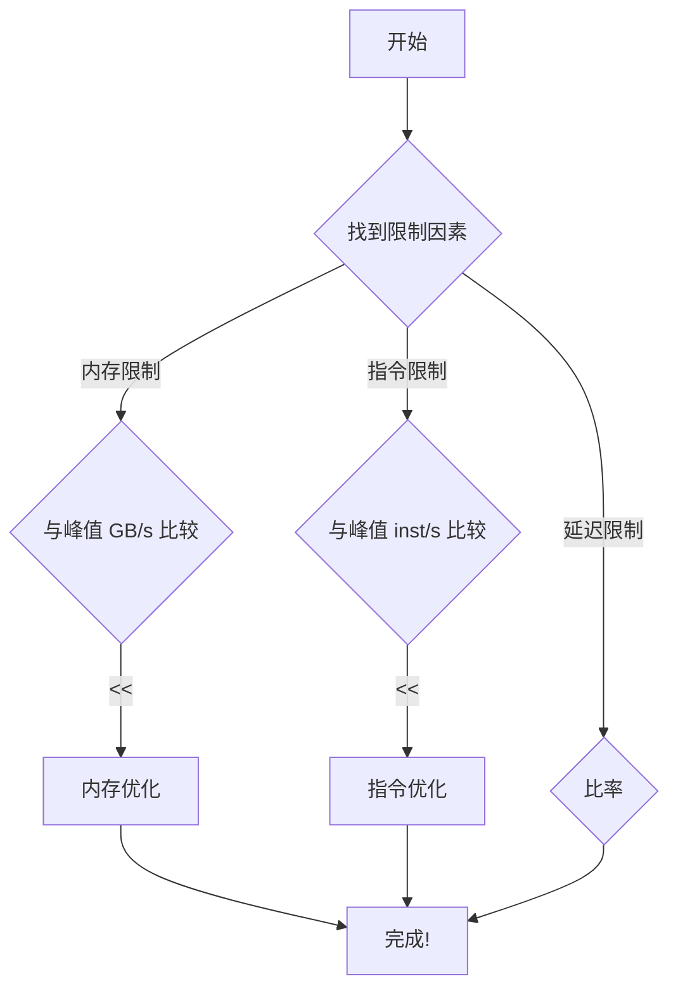
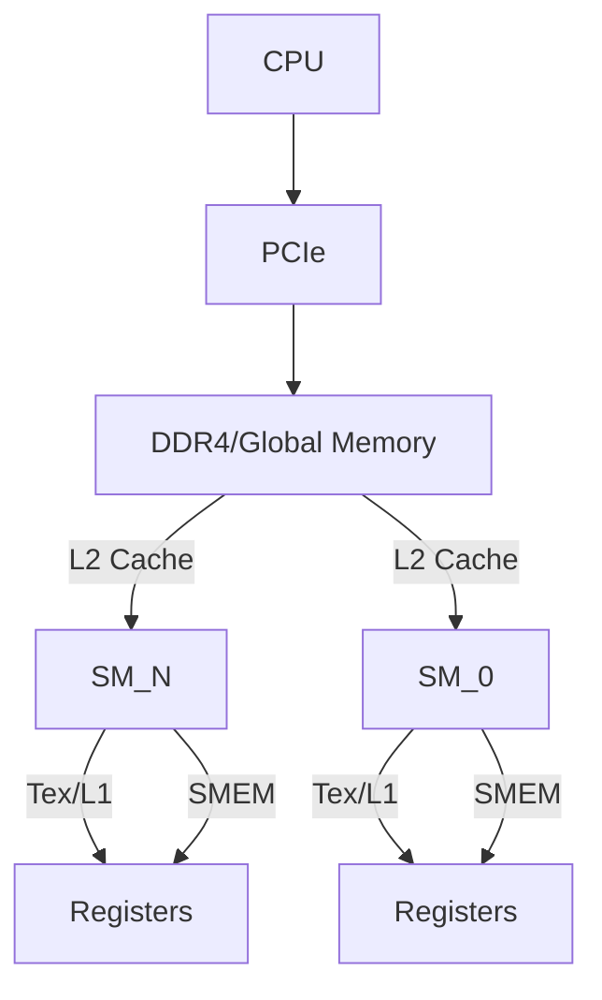

## CUDA 性能优化 Profiler 分析笔记

### 1. CUDA 调试工具：cuda-gdb 

* **编译选项**：在编译 CUDA 程序时，需要使用 `-g -G` 选项以生成调试信息。在 Linux 环境下，可能需要停止 X-server 并进入命令行环境进行调试 。
* **常用调试命令**：
    * `breakpoint (b)`: 设置断点，可以是方法名或行号，使程序在指定位置暂停执行 。
    * `run (r)`: 在调试器内执行程序 。
    * `next (n)`: 单步执行到下一行代码 。
    * `continue (c)`: 继续执行已暂停的程序，直到下一个断点或程序结束 。
    * `backtrace (bt)`: 显示当前方法调用栈中的内容 。
    * `thread`: 列出当前主机线程 。
    * `cuda thread`: 列出当前活跃的 GPU 线程（如果存在） 。
    * `cuda kernel`: 列出当前活跃的 GPU Kernel，并允许将“焦点”转移到指定的 GPU 线程 。

### 2. 性能优化流程 

性能优化是一个系统性的过程，通常包括以下步骤：

1.  **选择合适的性能指标**：
    * 并非所有 kernel 都适合使用 $GFLOPS/s$ 作为性能指标，例如，对于内存密集型 kernel（如转置操作），$GFLOPS/s$ 没有意义 。
    * 应根据 kernel 的类型选择合适的指标。

2.  **确定性能瓶颈**：分析 kernel 性能受限于哪些因素 ：
    * 内存限制 (Memory-bound) 
    * 延迟限制 (Latency-bound) 
    * 指令限制 (Instruction-bound) 
    * 上述因素的组合 

3.  **解决瓶颈**：按照重要性顺序解决限制因素 。

4.  **评估优化效果**：
    * 确定资源利用率与硬件限制的接近程度 。
    * 分析可能存在的低效率 。
    * 应用优化措施，这些优化通常会根据硬件运行方式自然产生 。

**Kernel 优化工作流程图示** ：



### 3. Profiler 注意事项 

* **计数器报告范围**：大多数计数器是按流多处理器 (SM) 报告的，而不是整个 GPU。例外是 L2 和 DRAM 计数器 。
* **多次运行**：单次运行只能收集少数计数器。当需要分析更多计数器时，需要多次运行。Visual Profiler 会自动完成此操作，但使用命令行 profiler 则需要手动完成 。
* **计数器值波动**：重复运行的计数器值可能不完全相同。这是因为线程块和 warp 在运行时是任意调度的。因此，“两个计数器相等”通常意味着“两个计数器在一个很小的 delta 范围内” 。
* **参考文档**：有关更多信息，请参阅 profiler 文档（如 CUDA_Profiler_Users_Guide.pdf） 。

### 4. 内存层次结构 

CUDA 设备具有多级内存层次结构，从快到慢、从私有到全局依次为：

* **寄存器 (Registers)**：每个 SM 上的最快内存，每个线程私有 。
* **共享内存 (Shared Memory, SMEM)**：每个 SM 上的片上内存，由 SM 内的线程块共享，速度很快 。
* **L1/纹理缓存 (Tex/L1)**：SM 上的缓存，用于加速对全局内存的访问 。
* **L2 缓存 (L2)**：GPU 上的全局缓存，由所有 SM 共享 。
* **全局内存 (Global Memory)**：设备内存（DRAM，如 DDR4），由所有 SM 访问，速度相对较慢 。
* **PCIe**: 用于 CPU 和 GPU 之间的数据传输 。
* **CPU DRAM**: 主机内存 。



### 5. 性能场景示例 

通过内存 (mem)、算术 (math) 和总执行时间 (full) 的对比，可以判断 kernel 的瓶颈：

* **内存限制 (Memory-bound)**：`mem` 时间与 `full` 时间接近，且 `mem` 和 `math` 有良好重叠。这表明内存吞吐量是瓶颈，并且延迟得到了很好的隐藏（假设内存吞吐量与硬件理论峰值接近） 。
* **算术限制 (Math-bound)**：`math` 时间与 `full` 时间接近，且 `mem` 和 `math` 有良好重叠。这表明指令吞吐量是瓶颈，并且延迟得到了很好的隐藏（假设指令吞吐量与硬件理论峰值接近） 。
* **均衡型 (Balanced)**：`mem` 和 `math` 时间都相对较短，且有良好重叠。这表明内存和指令吞吐量都得到了充分利用，并且延迟得到了很好的隐藏 。
* **内存和延迟限制 (Memory and Latency bound)**：`mem` 时间与 `full` 时间接近，但 `mem` 和 `math` 重叠度差。这表明内存是瓶颈，且延迟隐藏不足 。

### 6. Little 定律 

Little 定律描述了并发系统中的一个基本关系：

$L = \lambda W$

其中：
* $L$ 是系统中平均的“在途”项的数量（例如，在 CUDA 中可以是飞行中的 warp 数量） 。
* $\lambda$ 是项到达或完成的平均速率（吞吐量） 。
* $W$ 是项在系统中停留的平均时间（延迟） 。

在 CUDA 性能优化中，它可以表示为：

**所需 Warps 数量 = 延迟 $\times$ 吞吐量** 

这个定律对于理解如何通过并行度来隐藏延迟至关重要 。

### 7. 内存延迟与吞吐量 

* **内存延迟 (Latency)**：执行一个内存操作所需的时间。通常，内存延迟很高（例如，200+ 周期）。在这段时间内，无法启动依赖于该内存操作的后续操作 。
    * 例如：`float m = Md[i]; // takes 400+ cycles to execute` 
        `float f2 = m * f; // dependent, must wait for completion (stall)` 
    * 但如果存在独立的内存操作，可以同时启动以隐藏延迟：
        `float n = Nd[i]; // independent, can start anytime` 

* **内存吞吐量 (Throughput)**：每个周期完成的内存操作数量。吞吐量是速率，而延迟是时间。例如，Tesla V100 的内存吞吐量为 898.048 GB/s，约等于 256 次 32 位加载操作/周期 。

* **隐藏内存延迟** ：
    * 根据 Little 定律，要隐藏内存延迟，需要保持足够多的数据在处理中。例如，如果内存延迟约 400 周期，吞吐量约 900 GB/s，那么需要保持约 400 KB 的数据在飞行中 。
    * **多种方法隐藏延迟** ：
        * **多线程 (Multithreading)**：使用足够多的线程来填充流水线，保持 100KB 或更多数据在飞行中 。
        * **指令并行 (Instruction Parallelism)**：每个线程执行更多的取指操作 。
        * **位级并行 (Bit-level Parallelism)**：使用 64/128 位取指操作 。
    * **每个线程做更多工作**：通过让每个线程处理更多数据（例如，一次取 100 字节而不是 4 字节），可以减少所需的线程数量，从而更有效地隐藏延迟 。
        * `Fetch 4B/thread – need 100 000 threads` 
        * `Fetch 100 B/thread – need 4 000 threads` 

* **结论修正** ：
    * “低占用率总是会干扰隐藏内存延迟的能力，导致性能下降” **是错误的**。在较低占用率下也可以获得更高的性能 。
    * “一般来说，如果指令中没有片外内存操作数与有片外内存操作数的比率较低，则需要更多的 warp” **是错误的**。在内存密集型 kernel 中，即使每个 SM 的 warp 数量较少，也可以接近内存峰值 。

### 8. 算术延迟与吞吐量 

* **算术延迟 (Arithmetic Latency)**：执行一个算术操作所需的时间。通常比内存延迟短（例如，约 11 周期） 。同样，无法启动依赖于该算术操作的后续操作 。
    * 例如：`x = a + b; // takes ≈11 cycles to execute` 
        `z = x + d; // dependent, must wait for completion (stall)` 
    * 如果存在独立的算术操作，可以同时启动以隐藏延迟：
        `y = a + c; // independent, can start anytime` 

* **算术吞吐量 (Arithmetic Throughput)**：每个周期完成的算术操作数量。例如，Tesla V100 的算术吞吐量为 14.1312 Tflop/s，约等于 5120 次乘加操作/周期 。

* **隐藏算术延迟** ：
    * 通过执行其他操作来隐藏延迟，可以使程序运行更快 。
    * 但如果并行度不足，将无法达到 100% 的吞吐量，因为“飞行中的操作”不足会导致空闲周期 。
    * 不同操作类型的延迟有所不同 。
    * 根据 Little 定律，对于算术操作，如果延迟约 11 周期，每个 SM 有 64 个核心，那么需要约 704 个并行操作/SM 来达到峰值 。
    * **并行化方式**：
        * **线程级并行 (Thread-level Parallelism, TLP)** ：不同线程执行独立的任务。
            ```c++
            // 示例：4个独立线程并行执行
            // thread 1: x = x + a; x = x + b; x = x + c;
            // thread 2: y = y + a; y = y + b; y = y + c;
            // thread 3: z = z + a; z = z + b; z = z + c;
            // thread 4: w = w + a; w = w + b; w = w + c;
            ```
            在硬件层面，TLP 使得调度器可以在一个线程因等待而停顿时切换到另一个就绪的线程执行，从而保持 SM 繁忙。

        * **指令级并行 (Instruction-level Parallelism, ILP)** ：单个线程内存在多条独立的指令可以并发执行。
            ```c++
            // 示例：单个线程内4个独立操作
            // w = w + a;
            // z = z + a;
            // y = y + a;
            // x = x + a;
            // (假设 w, z, y, x 都是独立变量，a, b 也是独立变量)
            // w = w + b;
            // z = z + b;
            // y = y + b;
            // x = x + b;
            ```
            ILP 允许指令在流水线中重叠执行，减少单线程的有效延迟。

    * **结合 ILP 和 TLP** ：
        * GPU 可以同时利用 ILP 和 TLP 。
        * 例如，即使没有 ILP，在 35% 占用率下也能达到约 100% 峰值；如果有 3 个独立操作可以在每个线程中同时处理，那么在 12% 占用率下也能达到峰值 。

* **结论修正** ：
    * “提高占用率是唯一改善延迟隐藏的方法” **是错误的**。提高 ILP 也是一种方法 。
    * “占用率是利用率的一个指标” **是错误的**。占用率只是影响利用率的因素之一 。

### 9. 寄存器溢出 (Register Spilling) 

* **寄存器与线程数量关系**：每个 SM 的寄存器总量是固定的。因此，如果线程数量减少，每个线程可以分配到的寄存器数量就会增加 。
    * 例如，在 GV100 上，在 100% 占用率下每个线程有 32 个寄存器可用，而在 12.5% 占用率下可以达到 255 个寄存器 。
* **寄存器溢出**：当一个线程所需的寄存器数量超过可用限制时，编译器会将一些寄存器数据“溢出”到本地内存（global memory 的一部分，速度较慢）。这会引入额外的内存访问开销，从而降低性能 。
* **控制寄存器数量**：可以使用 `-maxrregcount` 编译选项或 `__launch_bounds__` 来减少寄存器使用数量，以避免溢出 。
* **寄存器速度优势**：只有寄存器足够快才能达到理论峰值性能 。
    * 例如，对于一个乘加操作 `a*b+c`（2 次浮点运算，12 字节输入，4 字节输出），需要 84.8 TB/s 的带宽才能匹配 14.1 TFlop/s 的计算峰值 。
    * **内存带宽对比** ：
        * **共享内存**：即使是共享内存，其带宽也有限制。例如，GV100 的共享内存带宽约为 14.1 TB/s 。
        * **全局内存**：全局内存的带宽更低，例如 900 GB/s 。
        * **对比**：为了达到计算峰值，所需带宽远远超过共享内存和全局内存的带宽，只有寄存器能提供足够的带宽 。
            * 全局内存需要比计算峰值所需带宽低 84.8TB/s / 0.9TB/s $\approx$ 94 倍 。
            * 共享内存需要比计算峰值所需带宽低 84.8TB/s / 14.1TB/s $\approx$ 6 倍 。
            * 这表明寄存器至少比共享内存快 6 倍，比全局内存快 94 倍 。

* **结论修正** ：
    * “事实上，对于 warp 的所有线程，访问共享内存的速度与访问寄存器一样快，只要线程之间没有 bank 冲突” **是错误的**。通过使用更多寄存器可以运行更快，寄存器的速度远超共享内存 。

### 10. 矩阵乘法案例研究 

矩阵乘法是一个典型的计算密集型任务，但其性能优化涉及内存访问模式和寄存器使用。

* **分阶段计算** ：
    * 将 kernel 拆分成多个阶段，每个阶段处理 `Md` 和 `Nd` 的子集并累加到 `Pd` 。
    * 每个阶段都应具有良好的数据局部性 。
    * 这通常通过瓦片化 (tiling) 实现，将大矩阵分解为小块，并利用共享内存来提高数据复用。

    ```c++
    // 概念性代码示例 (CUDA kernel 内部)
    // TILE_WIDTH 定义了瓦片的大小
    __shared__ float sA[TILE_WIDTH][TILE_WIDTH];
    __shared__ float sB[TILE_WIDTH][TILE_WIDTH];

    // 每个线程负责计算 C 矩阵的一个元素
    int col = blockIdx.x * blockDim.x + threadIdx.x;
    int row = blockIdx.y * blockDim.y + threadIdx.y;

    float Cvalue = 0;

    // 分阶段计算
    for (int m = 0; m < (WIDTH / TILE_WIDTH); ++m) {
        // 将 Md 和 Nd 的子集加载到共享内存
        sA[threadIdx.y][threadIdx.x] = Md[row * WIDTH + (m * TILE_WIDTH + threadIdx.x)];
        sB[threadIdx.y][threadIdx.x] = Nd[(m * TILE_WIDTH + threadIdx.y) * WIDTH + col];
        __syncthreads(); // 确保所有共享内存加载完成

        // 在共享内存上执行乘加
        for (int k = 0; k < TILE_WIDTH; ++k) {
            Cvalue += sA[threadIdx.y][k] * sB[k][threadIdx.x];
        }
        __syncthreads(); // 确保所有共享内存计算完成
    }

    Pd[row * WIDTH + col] = Cvalue;
    ```

* **性能提升示例** ：
    * 原始代码（未优化）显示 2590.61 GFlop/s 。
    * 使用更大的矩阵（例如 1024x1024）并指定 32 个寄存器时，性能提升到 3460.02 GFlop/s 。
    * 移除 `-maxrregcount 32` 或增加到 255（允许编译器使用更多寄存器）后，性能略微提升到 3478.04 GFlop/s 。这表明在这个阶段，寄存器数量并非主要瓶颈，或者编译器已经优化得很好了。

* **基准性能与共享内存带宽限制** ：
    * 当每个线程计算一个输出时，性能达到 3478.04 GFlop/s 。
    * 如果每次浮点运算需要 2 次共享内存访问（即 2 flop 对应 4 B/Flop），那么共享内存带宽将成为限制。在这种情况下，共享内存带宽限制的理论峰值约为 3532.8 GFlop/s 。
    * 这说明当前性能已经非常接近共享内存的理论带宽限制 。
    * 示例代码可以在 `Samples/0_Simple/matMul` 中找到 。

### 11. Visual Profiler 

* **工具介绍**：Visual Profiler 可作为独立应用程序 `nvvp` 使用，也可以作为 Nsight Eclipse Edition 的一部分 。
* **工作原理**：它会自动启动 `nvprof` 进行多次运行，以收集各种信息并进行显示 。
* **可测量指标**：
    * **事件 (event)**：设备上可计数、可测量的活动、动作或发生。可以通过 `nvprof --query-events` 命令查询所有可用事件 。
    * **指标 (metric)**：从一个或多个事件值计算出的应用程序特性。可以通过 `nvprof --query-metrics` 命令查询所有可用指标 。
* **界面示例**：
    * 创建新的会话，设置可执行文件路径、工作目录和参数等 。
    * 分析结果会显示 Kernel 性能的瓶颈，例如“Kernel Performance is Bound by Memory Bandwidth”（Kernel 性能受内存带宽限制）。图表会直观地展示性能瓶颈的来源 。

这些笔记涵盖了 CUDA 性能分析和优化中的核心概念，包括调试工具、性能瓶颈识别、内存和算术延迟/吞吐量、Little 定律的应用、寄存器使用以及 Visual Profiler 的作用。理解这些概念对于编写高性能 CUDA 代码至关重要。